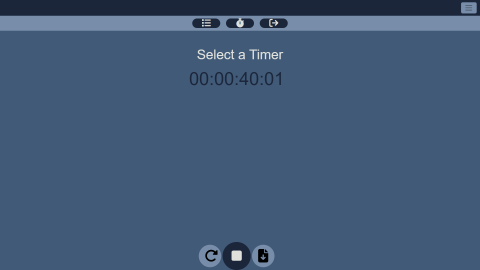

# Time Management Pro

#### Video Demo:  <URL HERE>

#### Description:
## Overview

Time is our most valuable resource. We all know this and yet we still allow so much time to be wasted. Wasting time causes me stress and regret,
I'm sure it does the same for others so I decided to create:

**Time Management Pro.**

Time Management Pro is a productivity application that allows a user to keep track of the time they spend on any task they choose.

It features an interactive stopwatch, customizable timer categories, login/logout functionality, and a list of all the time spent for each category.

## Installation

## Usage
Login or register for an account.
Click "Select a Timer".
Add a new timer.
Start the stopwatch.
End the stopwatch and save.
Visit the stopwatch logs for total time spent.

## Tech Stack

The app was created using the software architectural pattern: MVC (Model-View-Controller).

Tech Stack:

Model: SQLite for the database.
View: Html, Css, Javascript, Jinja for the UI.
Controller: Flask and Python for app logic and data flow.

## Development Process

The proccess for making Time Management Pro incorparated the Waterfall Model from the Software Development Life Cycle.

I was considering making a program that was completely native to the computer but decided against it
